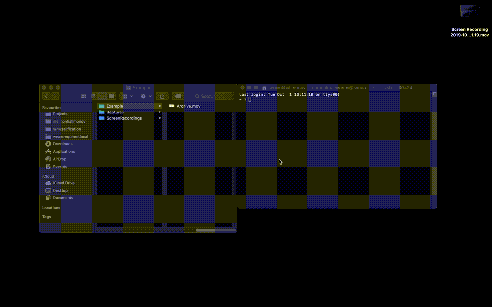

I created a small shell script to convert all `.mov` screenrecordings from MacOS (which are useless for GitHub :face_with_head_bandage:) to perfect `.gif` for GitHub.
I created this script because I had to share a bunch of videos of prototypes on GitHub and all other tools didn't work right for me.

All you need is `ffmpeg` which you can install with `brew install ffmpeg`.

The script:

```bash
for i in *.mov; 
do ffmpeg -i "$i" -vf scale="1000:-1" -fs 9.5M "${i%.*}.gif"; 
done
```



Usage:

1. change to a folder via Terminal
2. insert script
3. wait until all .movers are converted

Alternatively you can add the `.bash_profile` itself so you don't always have to copy it.